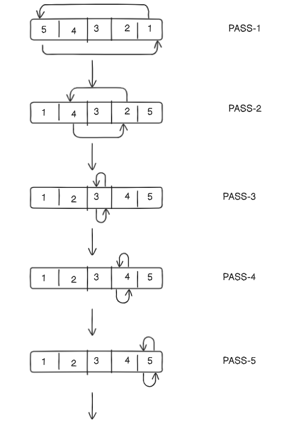
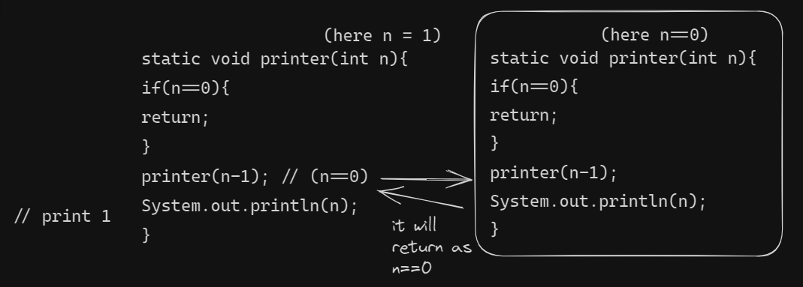
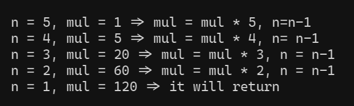
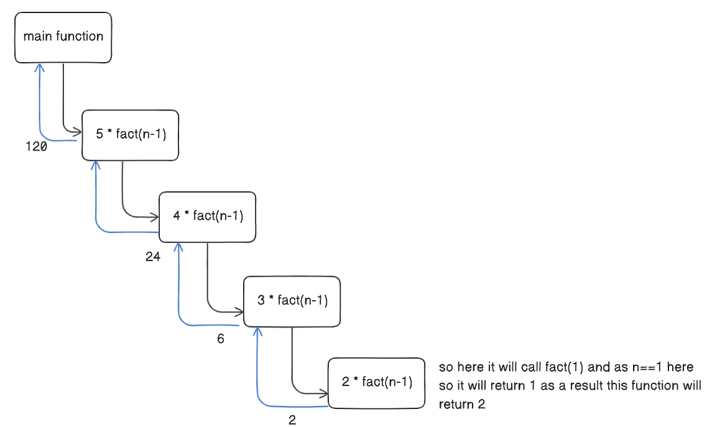
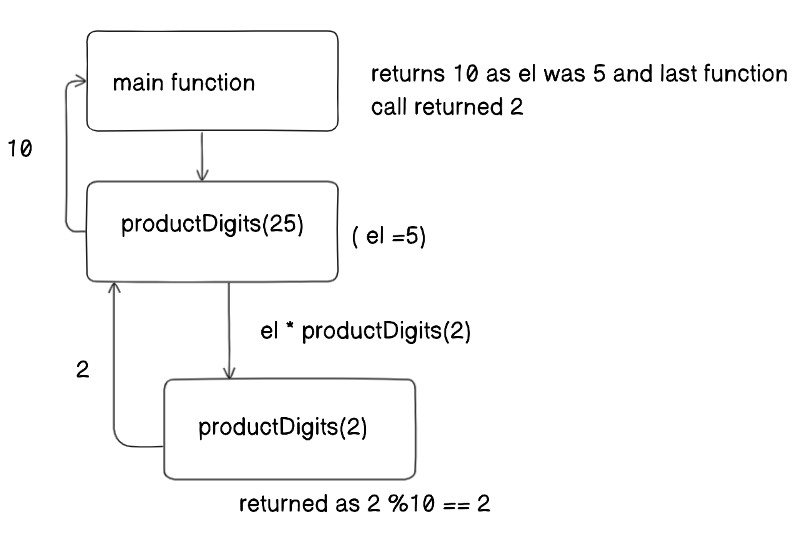
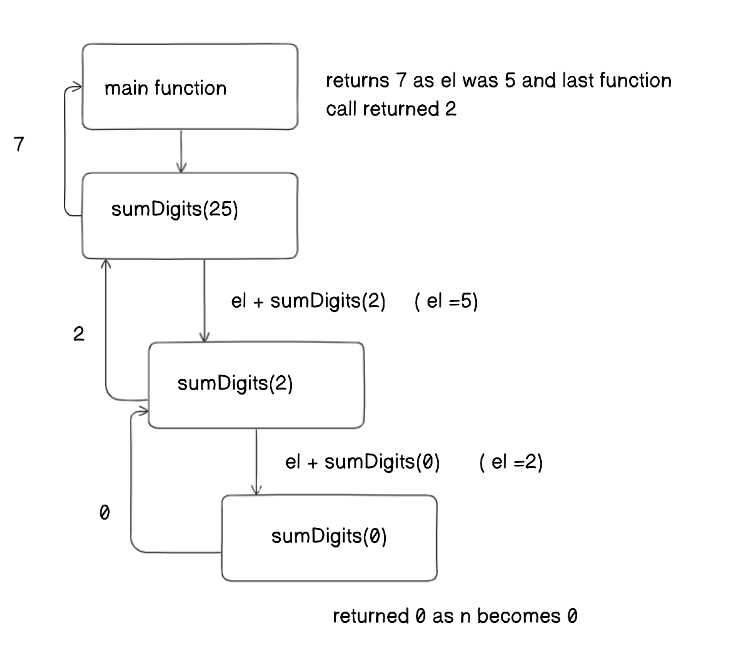

## Arrays

### Question-1

- [Count Frequency in a range](https://www.codingninjas.com/studio/problems/count-frequency-in-a-range_8365446?leftPanelTab=0)

- topic - `arrays` `HashMap`

- #### Approach

  - Initialised the map with element of the nums array as key and occurrence as the value.
  - Iterated the nums array and checked whether the element is there in map if yes then increase the count by one and if not then make it `one`.
  - Then iterate from 1 to n and check whether the ith number is there in the map if yes then store the occurrence in the array `arr` and if not then store zero in the array `arr` at that index.

- #### Code

```java
    import java.util.HashMap;

    public class Solution {
        public static int[] countFrequency(int n, int x, int []nums){
        HashMap<Integer,Integer> map = new HashMap<>();
            for(int i=0;i<n;i++){
                map.put(nums[i],map.getOrDefault(nums[i], 0)+1);
            }
            int[] arr = new int[n];
            for(int i=1;i<=n;i++){
                if(map.containsKey(i)){
                    arr[i-1] = map.get(i);
                }else{
                    arr[i-1] = 0;
                }
            }
            return arr;
        }
    }
```

### Question-2

- [Sum of second largest in even position and second smallest number in odd position](https://prepinsta.com/accenture-coding-question-2/)

- topic - `arrays`

- #### Approach

  - Initialised large, secLarge with `Integer.MIN_VALUE`, small and secSmall with `Integer.MAX_VALUE` value
  - Iterated till the array length and checked if the position is even or odd
  - If even then check whether the number is greater than large if yes then assign secLarge with large value and assign large with `arr[i]`
  - If odd then check whether the number is smaller than small if yes then assign secSmall with smalll value and assign small with `arr[i]`
  - Finally return the sum of `secLarge` and `secSmall`.

- #### Code

```java
    public class SumOfSecondSmallestAndSecondLargest {
    public static void main(String[] args) {
        int[] arr = new int[]{1,8,0,2,3,5,6};
        System.out.println(sum(arr));
    }
    static int sum(int[] arr){
        int large=Integer.MIN_VALUE,secLarge=Integer.MIN_VALUE, small=Integer.MAX_VALUE, secSmall=Integer.MAX_VALUE;
        for(int i=0;i<arr.length;i++){
            if(i%2==0){
                if(arr[i]>large){
                    secLarge = large;
                    large = arr[i];
                }else if(arr[i]>secLarge && arr[i]!=large){
                    secLarge = arr[i];
                }
            }else{
                if(arr[i]<small){
                    secSmall = small;
                    small = arr[i];
                }else if(arr[i]<secSmall && arr[i]!=small){
                    secSmall = arr[i];
                }
            }
        }
        return secLarge + secSmall;
    }
}

```

> Note: The time complexity of the above approach is O(n) + O(n) which is O(2n) ignoring the constant it is O(n)

### Question-3

- [Terms Of AP](https://www.codingninjas.com/studio/problems/terms-of-ap_9065116?challengeSlug=ninja-slayground)

- topic - `arrays`

- #### Approach

  - Initialised `count = 0`, `j=1` and created and array `arr` with the size of x (as we have to store the x elements which are not divisble by 4)
  - Iterated while loop until count becomes x and checked if the number in the series is divisible 4 if not then add the number in the array and increase the count
  - finally return this array.

- #### Code

```java
    import java.util.* ;
    import java.io.*;
    public class Solution {
        public static int[] termsOfAP(int x){
            int count = 0;
            int j = 1;
            int[] arr = new int[x];
            while(count!=x){
                if((3*j+2)%4!=0){
                    arr[count] = 3*j+2;
                    count++;
                }
                j++;
            }
            return arr;
        }
    }

```

### Question-4

- [Selection Sort](https://www.codingninjas.com/studio/problems/selection-sort_624469?leftPanelTab=0)

- topic - `arrays` `sorting`

- #### Approach

  - we need to itearate for n-1 pass where (n= array's length)
  - In each iteration we will find the min number index from the array start=i to end=n-1 and then we will swap the min number with the i index.
  - So after each iteration we will have sorted array towards the left of i index.
    

- #### Code

```java
    import java.util.Arrays;

    public class SelectionSort {
      public static void main(String[] args) {
        int[] arr = new int[]{5};
        selectionsort(arr,arr.length);
        System.out.println(Arrays.toString(arr));
      }
      static void selectionsort(int[] arr, int n){
        for(int i=0;i<n-1;i++){
          int minIndex = minIndex(arr,i,n);
          int temp = arr[minIndex];
          arr[minIndex] = arr[i];
          arr[i] = temp;
        }
      }
      static int minIndex(int[] arr, int start, int end){
        int minIndex = start;
        for(int i=start;i<end;i++){
          if(arr[i]<arr[minIndex]){
            minIndex = i;
          }
        }
        return minIndex;
      }

    }


```

#### Note:

- **Time complexity: O(N2)**, (where N = size of the array), for the best, worst, and average cases.
- **Space Complexity: O(1)**,

> Reason: If we carefully observe, we can notice that the outer loop, say i, is running from 0 to n-2 i.e. n-1 times, and for each i, the inner loop j runs from i to n-1. For, i = 0, the inner loop runs n-1 times, for i = 1, the inner loop runs n-2 times, and so on. So, the total steps will be approximately the following: (n-1) + (n-2) + (n-3) + ……..+ 3 + 2 + 1. The summation is approximately the sum of the first n natural numbers i.e. (n\*(n+1))/2. The precise time complexity will be O(n2/2 + n/2). Previously, we have learned that we can ignore the lower values as well as the constant coefficients. So, the time complexity is O(n2). Here the value of n is N i.e. the size of the array.

### Question-5

- [Bubble Sort](https://www.codingninjas.com/studio/problems/bubble-sort_624380)

- topic - `arrays` `sorting`

- #### Approach

  - Iterated the array for n-1 passes (n=array length)
  - Used the second loop to iterate the array till second last element of the unsorted part of the array.
  - boolean swap variable is used to check whether the array is sorted or not if the array is sorted then we do not have to run the second loop for every pass so in the first pass no swapping occurs then it means that array is sorted hence break the loop.
  - for dry run and more detailed explanation [visit](https://takeuforward.org/data-structure/bubble-sort-algorithm/)

- #### Code

```java

public class Solution {
  public static void bubbleSort(int[] arr, int n) {
    boolean swap = false;
    for(int i=1;i<n;i++){
      swap = false;
      for(int j=0;j<=n-1-i;j++){
        if(arr[j]>arr[j+1]){
          int temp = arr[j];
          arr[j] = arr[j+1];
          arr[j+1]=temp;
          swap = true;
        }

      }
      if(!swap){
        break;
      }
    }
  }

}
```

#### Note:

- Time complexity
  - O(n^2) for worst and average case
  - O(n) for best case ( and it happens when array is sorted )
- Space Complexity
  - O(1)

### Question-6

- Insertion Sort

- topic - `arrays` `sorting`

- #### Approach

  - Iterate for n pass where n is the length of the array.
  - Iterate from ith element towards the left in inner loop while checking that j-1 element should be smaller than jth element if not then go inside the loop and swap until the jth element is at the correct index.

- #### Code

```java
import java.util.Arrays;

public class InsertionSort {
    public static void main(String[] args) {
        int[] arr = new int[]{1,2,3,4,5};
        insertionSort(arr,arr.length);
        System.out.println(Arrays.toString(arr));
    }
    static void insertionSort(int[] arr,int n){
        for(int i=0;i<n;i++){
            int j=i;
            while(j>0 && arr[j-1]>arr[j]){
                int temp = arr[j];
                arr[j] = arr[j-1];
                arr[j-1] = temp;
                j--;
            }
        }
    }
}

```

#### Note:

- Time complexity
  - O(n^2) for worst and average case
  - O(n) for best case ( if the array is sorted )
- Space complexity
  - O(1)

### Question-7

- [Merge Sort](https://www.codingninjas.com/studio/problems/merge-sort_5846?leftPanelTab=0)

- topic - `arrays` `sorting`

- #### Approach

  - Basic understanding
    - This is a divide and conqueror approach in which we will divide and merge array.
    - Dividing means we will not create separate array, we will divide the array using index.
  - Actual approach:

    - We will create two functions mergeSort and merge, mergeSort will be responsible for diving the array until there is only element left in the array and merge will merge the two arrays of single element or array of more than one elements.
    - MergeSort
      - So, in mergeSort(), we will divide the array around the middle index(rather than creating a separate array) by making the recursive call :
        1. mergeSort(arr,low,mid) [Left half of the array]
        2. mergeSort(arr,mid+1,high) [Right half of the array]
           where low = leftmost index of the array, high = rightmost index of the array, and mid = middle index of the array.
      - Now, in order to complete the recursive function, we need to write the base case as well. so from the above understanding we know that we need to return when there is only one element left in the array and that can be achieved by `if(low>=high) break;`
      - pseudo code:
        ```java
          mergeSort(arr,low,high){
            if(low>=high)
              break;
            int mid = (low+high)/2;
            mergeSort(arr,low,mid);
            mergeSort(arr,mid+1,high);
            merge(arr,low,mid,high);
          }
        ```
    - Merge

      - In the merge function, we will use a temp array to store the elements of the two sorted arrays after merging. Here, the range of the left array is low to mid and the range for the right half is mid+1 to high.
      - Now we will take two pointers left and right, where left starts from low and right starts from mid+1.
      - Using a while loop `while(left <= mid && right <= high)`, we will select two elements, one from each half, and will consider the smallest one among the two. Then, we will insert the smallest element in the temp array.
      - After that, the left-out elements in both halves will be copied as it is into the temp array.
      - Now, we will just transfer the elements of the temp array to the range low to high in the original array. The pseudo code will look like the following:

      ```java
        static void merge(int[]arr, int low,int mid,int high){
          int left = low;
          int right = mid+1;
          ArrayList<Integer> list = new ArrayList<>();
          while(left<=mid && right<=high){
            if(arr[left]<=arr[right]){
              list.add(arr[left]);
              left++;
            }else{
              list.add(arr[right]);
              right++;
            }
          }
          while(left<=mid){
            list.add(arr[left]);
            left++;
          }
          while(right<=high){
            list.add(arr[right]);
            right++;
          }
          for(int i=low;i<=high;i++){
            arr[i] = list.get(i-low);
          }
        }

      ```

- #### Code

```java
import java.util.ArrayList;

public class Solution {

  public static void mergeSort(int[] arr, int l, int r){
    if(l>=r){
      return;
    }
    int mid = (l+r)/2;
    mergeSort(arr, l, mid);
    mergeSort(arr, mid+1, r);
    merge(arr,l,mid,r);
  }
  static void merge(int[]arr, int low,int mid,int high){
    int left = low;
    int right = mid+1;
    ArrayList<Integer> list = new ArrayList<>();
    while(left<=mid && right<=high){
      if(arr[left]<=arr[right]){
        list.add(arr[left]);
        left++;
      }else{
        list.add(arr[right]);
        right++;
      }
    }
    while(left<=mid){
      list.add(arr[left]);
      left++;
    }
    while(right<=high){
      list.add(arr[right]);
      right++;
    }
    for(int i=low;i<=high;i++){
      arr[i] = list.get(i-low);
    }
  }
}

```

#### Note:

- Time complexity:
  - O(nlogn) ( Reason: At each step, we divide the whole array, for that logn and we assume n steps are taken to get a sorted array, so overall time complexity will be nlogn )
- Space compplexity:
  - O(n) (Reason: We are using a temporary array to store elements in sorted order.)

### Question-8

<!-- question name within [] and link within () -->

- [Quick Sort](https://www.codingninjas.com/studio/problems/quick-sort_983625?leftPanelTab=0)

- topic - `arrays` `sorting`

- #### Some more info:

  - It's not a stable algorithm
  - In place sorting algorithm that's why it is prefered over merge sort because it does not take O(n) extra space which merge sort takes. Merge sort is better in linked list because the memory allocation is not continous.

- #### Approach

  - for approach [visit](https://takeuforward.org/data-structure/quick-sort-algorithm/)

- #### Code

```java
import java.util.* ;
import java.io.*;
public class Solution {
    public static List<Integer> quickSort(List<Integer> arr){
        sorter(arr, 0, arr.size()-1);
        return arr;
    }

    static void sorter(List<Integer> arr,int low,int high){
        if(low>high){
            return;
        }
        int pivotIndex = placePivot(arr,low,high);
        sorter(arr,low,pivotIndex-1);
        sorter(arr, pivotIndex+1, high);
    }

    static int placePivot(List<Integer> arr, int low, int high){
        int pivot = arr.get(low);
        int i = low, j=high;
        while(i<j){
            while(arr.get(i)<=pivot && i<=high-1){
                i++;
            }
            while(arr.get(j)>pivot && j>=low+1){
                j--;
            }
            if(i<j){
                swap(arr, i, j);
            }
        }
        swap(arr, low, j);
        return j;
    }
    static void swap(List<Integer> list, int first, int second){
        int temp = list.get(first);
        list.set(first,list.get(second));
        list.set(second,temp);
    }
}
```

#### Note:

- Time complexity:
  - Worst case: `O(n^2)` ( it happens when pivot element is the largest number or the smallest number in the array so if the pivot number is largest, then all the numbers will be towards the left which will result into the recurrence relation `T(n) = T(0) + T(n-1) + O(n)` which will lead to O(n^2))
  - Best case: `O(nlogn)`
- Space complexity: `O(1)`

### Question-9

- **Print from N to 1**

- topic - `arrays` `recursion`

- #### Approach

  - Taking n as parameter
  - if n==0 then return and this is the base case.
  - we will print the n
  - Then we call printReverse(n-1)
  -

- #### Code

```java
    // question: You are given a number n and the task is to print from n to 1. using recursion
public class PrintInReverse {
  public static void main(String[] args) {
    printReverse(5);
  }
  static void printReverse(int n){
    if(n==0){
      return;
    }
    System.out.println(n);
    printReverse(n-1);
  }
}
```

### Question-10

- **Print from 1 to n**

- topic - `arrays` `recursion`

- #### Approach
  - Took the number n as parameter
  - If n==0 then return as we want to print till 1
  - Else call the function again with `n-1` as the value and then print the number n.
  - When printer(1) is called it will call printer(0) but as we have added the check that if n==0 return, so it will not do anything and function will return after that in printer(1) we will print the n value which is 1 then printer(1) will complete its execution as a result it will return to the place where it was called.
  - 
- #### Code

```java
    // The task is to print numbers from 1 to n when you are provided the number n
public class PrintFrom1ToN {
  public static void main(String[] args) {
    printer(5);
  }
  static void printer(int n){
    if(n==0){
      return;
    }
    printer(n-1);
    System.out.println(n);
  }
}

```

### Question-11

- Factorial

- topic - `arrays` `recursion`

- #### Approach
  - for approach - 1
    - we are taking two parameters n and mul
    - if n==0 or n==1 we will return mul (if n==0 or n==1 is passed then we will return 1 as we are passing mul=1 initially)
    - Then we are calculating `mul = mul * n`
    - Then we are calling `factorial(n-1,mull)`. Hence, for the value n=5 the flow will be like 
  - for approach - 2
    - We are taking only one parameter that is n and if n==1 || n==0 then we will return 1
    - Else we will call n \* factorial(n-1).
    - Now lets see the flow for n=5
- #### Code

```java
   public class MultiplyNTo1 {
  public static void main(String[] args) {
    System.out.println(factorial(6,1));
    System.out.println(factorial_1(6));
  }
  //    approach -1
  static int factorial(int n, int mul){
    if(n==0 || n==1){
      return mul;
    }
    mul = mul * n;
    return factorial(n-1,mul);
  }
  //    approach - 2
  static int factorial_1(int n){
    if(n==0 || n==1){
      return 1;
    }
    return n*factorial_1(n-1);
  }
}
```

### Question-12

<!-- question name within [] and link within () -->

- **Product of Digits**

- topic - `arrays` `recursion`

- #### Approach

  1. If n is a single-digit number (i.e., n is less than 10), the function returns n itself.

  2. Otherwise, the last digit of n is extracted using the modulo operation n % 10, and this digit is multiplied by the result of calling the productDigits function recursively on the remaining part of n obtained by removing the last digit (n / 10).

  3. The result of step ii is the product of the individual digits of the original number n.

  The code recursively breaks down the problem by working with the last digit of the number and then handling the rest of the number. This process continues until the number is reduced to a single digit, and the multiplication of digits is computed as the recursion unwinds.

  

- #### Code

```java
  public class ProductOfDigits {
    public static void main(String[] args) {
        System.out.println(productDigits(11));
    }
    static int productDigits(int n){
        if(n%10==n){
            return n;
        }
        int el = n%10;
        return el * productDigits(n/10);
    }
}
```

### Question-13

<!-- question name within [] and link within () -->

- **Sum of digits**

- topic - `arrays` `recursion`

- #### Approach

  - Taking the element as input
  - At each function call we are taking each digit from the number and then adding it with the rest of digits of the number by making another function call.
  - If the number is 0 or after taking out all the digits n becomes 0 then we return the function
    

- #### Code

```java
   public class SumOfDigits {
    public static void main(String[] args) {
        System.out.println(sumDigits(112));
    }
    static int sumDigits(int n){
        if(n==0){
            return 0;
        }
        int el = n%10;
        return el + sumDigits(n/10);
    }
}
```
